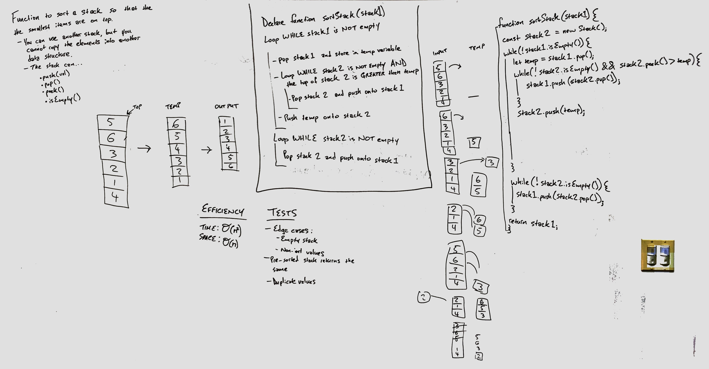

## 3.5: Sort Stack

> Write a program to sort a stack such that the smallest items are on the top. You can youse an additional temporary stack, but you may not copy the elements into any other data structure (such as an array). The stack supports the following operations: `push`, `pop`, `peek`, and `isEmpty`.

