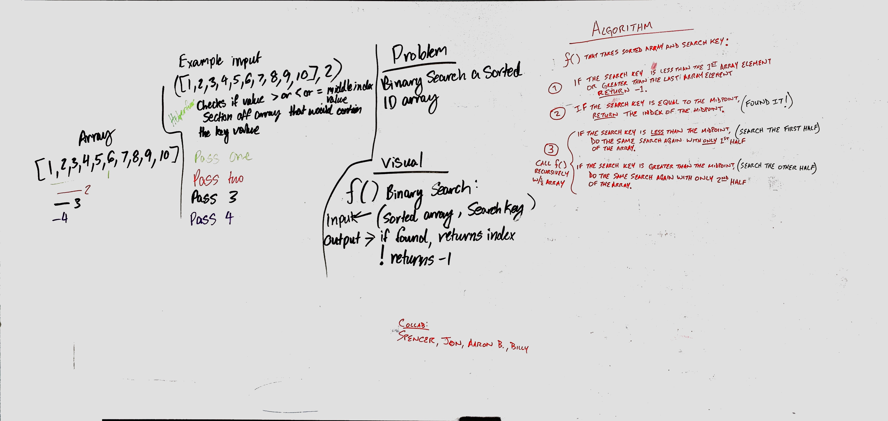

# arrayBinarySearch
<!-- Short summary or background information -->
## Summary
<!-- 
* A link to the PR for the branch your code was written to
* A link to your passing tests from that PR on travis-ci.com
* For Data Structures: A link to the documentation folder
* For Code Challenges: A photograph of your whiteboard 
-->
A short summary and background information for this challenge goes here. Add how far I got, if it's all good and passing, what more I'd like to do.
* [Challenge branch PR][1]
* [Travis CI][2]
* [Whiteboard photo][3]

[1]: xyz.com
[2]: xyz.com
[3]: xyz.com
[4]: xyz.com

## Challenge
<!-- Description of the challenge -->
* Write a function called `BinarySearch` which takes in 2 parameters: a sorted array and the search key. Without utilizing any of the built-in methods available to your language, return the index of the array’s element that is equal to the search key, or -1 if the element does not exist.

### Stretch Goal - **NOT COMPLETED**
Once you’ve achieved a working solution, benchmark with varying array sizes (100, 10000, 100000 elements)

## Approach & Efficiency
<!-- What approach did you take? Why? What is the Big O space/time for this approach? -->
The approach I took to solve this was…

The Big O space for this approach is…

The Big O time for this approach is…

## Solution
<!-- Embedded whiteboard image -->
### Whiteboard
Whiteboard portion of this challenge was done in collaboration with Spencer Hirata, Jon Gentry, and Aaron Bruce.

