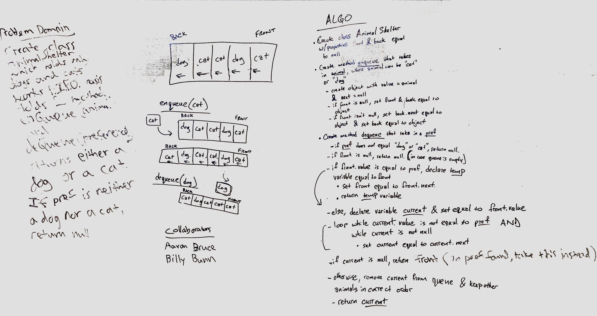

# fifoAnimalShelter

## Feature Tasks
* Create a class called `AnimalShelter` which holds only dogs and cats. The shelter operates using a first-in, first-out approach.
* Implement the following methods:
  * `enqueue(animal)`: adds `animal` to the shelter. `animal` can be either a dog or a cat object.
  * `dequeue(pref)`: returns either a dog or a cat. If `pref` is not `"dog"` or `"cat"` then return null.

## Stretch Goal
Once you’ve achieved a working solution, write a second function that removes an element from the middle index and shifts other elements in the array to fill the new gap.

## Whiteboard
Collaboration with Aaron Bruce

