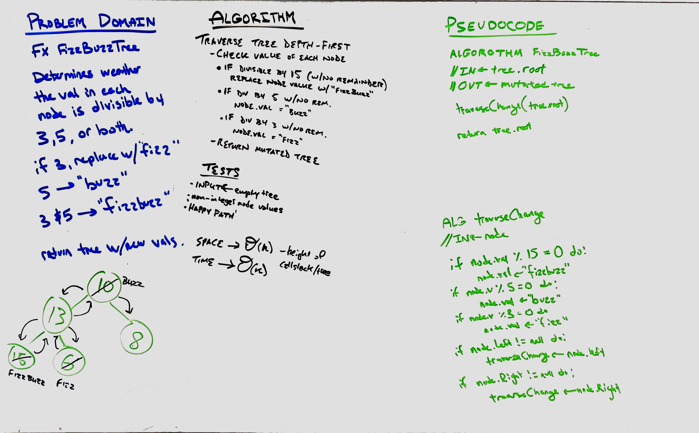

# FizzBuzz Tree
<!-- Short summary or background information -->

## Challenge
* Write a function called FizzBuzzTree which takes a tree as an argument.
* Without utilizing any of the built-in methods available to your language, determine weather or not the value of each node is divisible by 3, 5 or both, and change the value of each of the nodes:
  * If the value is divisible by 3, replace the value with “Fizz”
  * If the value is divisible by 5, replace the value with “Buzz”
  * If the value is divisible by 3 and 5, replace the value with “FizzBuzz”
* Return the tree with its new values.

## Approach & Efficiency
<!-- What approach did you take? Why? What is the Big O space/time for this approach? -->
### The Big O
#### Time
The time efficiency of this algorithm depends on the size of the input (the tree). 

The time efficiency is therefore `O(n)`.

#### Space
Because our algorithim is a recursive solution, the callstack builds up as the tree is traveresed depth-first. The biggest the callstack will ever be depends on the depth (or height) of the tree. 

The space efficiency is therefore `O(h)`, where `h` is the height of the tree.

## Solution
_Completed in collaboration with Jason Burns_

