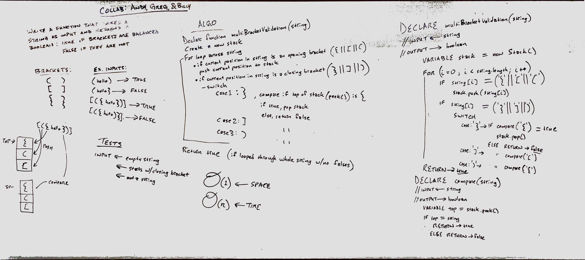

# multiBracketValidation

## Feature Tasks
* On your main file, create a function called `multiBracketValidation(input)`

Your function should take a string as its only argument, and should return a boolean representing whether or not the brackets in the string are balanced. There are 3 types of brackets:

* Round Brackets : `()`
* Square Brackets : `[]`
* Curly Brackets : `{}`

## Approach & Efficiency
As we visualized the problem domain, we knew we needed to loop through the string, somehow store all the opening brackets, then compare them with the closing brackets—starting with the **last** opening bracket stored. Because we needed to get each opening bracket using some sort of **LIFO** structure, we utilized a **Stack** in our algorithm.

* Because we're looping through the input string, our time efficiency is **O(n)**. 
* Because we're storing any opening brackets at the start of our input string in a stack, our space efficiency is **O(n)**.

## Whiteboard Solution
In collaboration with Andy Roska and Greg Dukes

### Note:
After taking the photo, we realized the Big O for space in this whiteboard is incorrect; the space efficiency for this algorithm is **O(n)**, as we're creating a stack of opening brackets whose size is dependent on the input.
